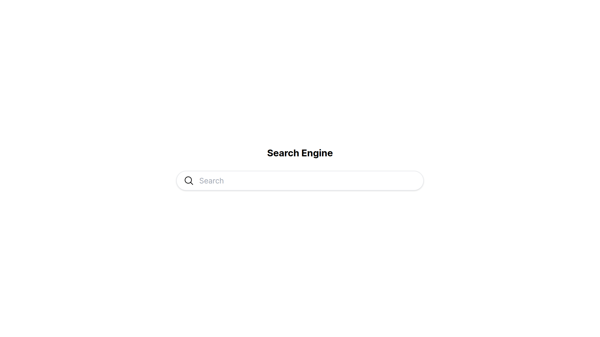
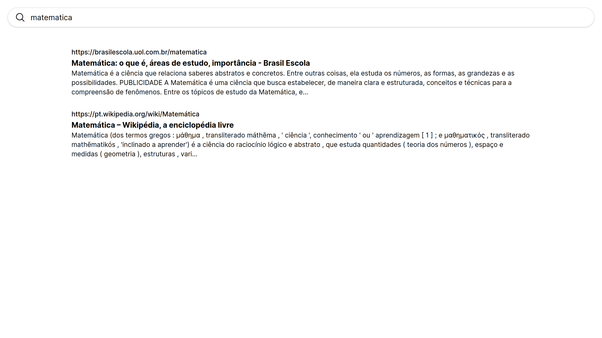

# Search Engine

This study project to understand how search engines really work, it is a very simple search system that analyzes web pages, tokenize them, and stores them in sqlite3 databases, at the time of searches, to order searches by relevance, the cosine similarity of word frequencies is calculated.

### Resources

- [x] Word tokenizer.
- [x] Unicode normalization.
- [x] Sort results based on cosine similarity word frequencies.
- [x] Website scrapping.
- [x] Web interface for search.

### Running

To run it you need to have rust installed, tested version 1.73.

1. Clone this repository and navigate to the directory:

   ```sh
   git clone https://github.com/grilario/search-engine.git
   cd search-engine
   ```

2. Run the following command:

   ```sh
   cargo run
   ```

## Usage

The web server is running on port 300 on your machine at http://localhost:3000.

- To perform a search, access the home page at "/" and type in input and press enter or access "/search?q=*our+search*" and type your search in the query parameter "q".
- For the system to index a page, make a request to "/insert?url=*our+link*" and add the page ulr to the query parameter "url".
</br>

  Exemple:

   ```sh
   curl http://localhost:3000/insert?url=https://www.rust-lang.org
   ```
### Images

<p align="center">
    
</p>
<p align="center">
    
</p>
